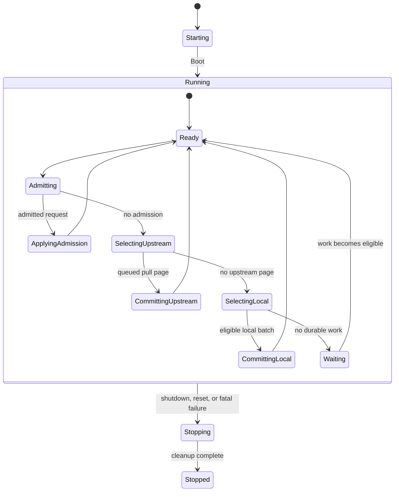
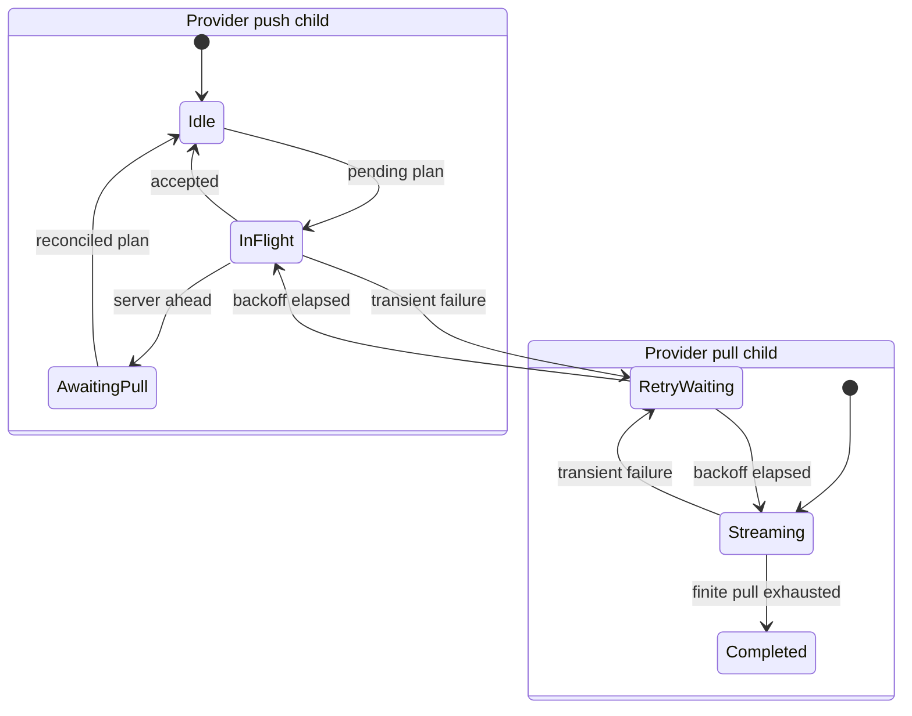
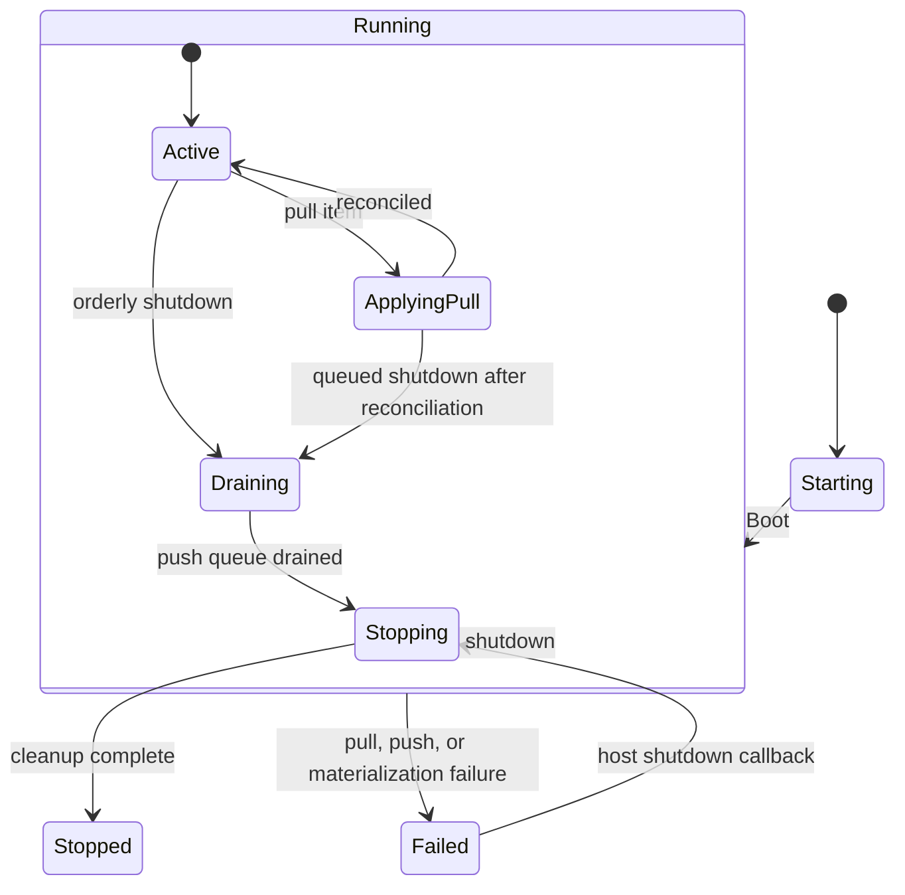
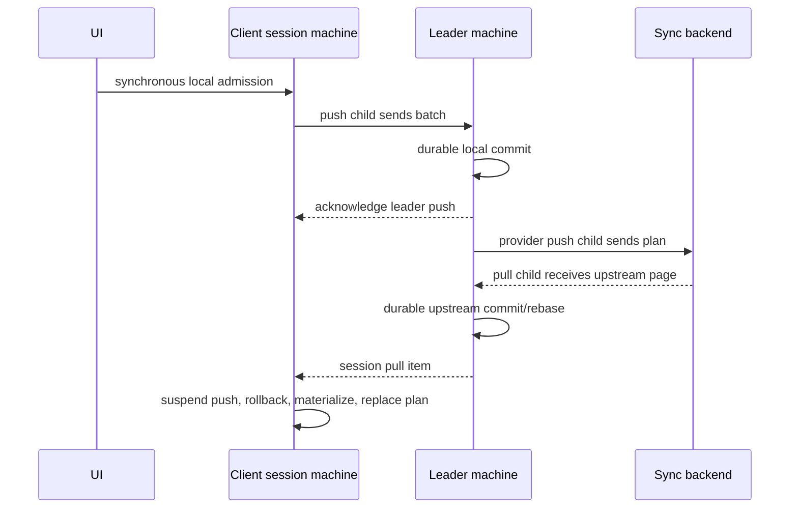

# Sync Processor Effect Machines

> **Status:** Draft local architectural proposal. This document records the implementation experiment and does not
> replace accepted product intent.

## Context

LiveStore has two cooperating synchronization coordinators:

- `LeaderSyncProcessor` owns durable ordering between client sessions, the eventlog, state materialization, and an
  optional upstream provider.
- `ClientSessionSyncProcessor` owns one session's optimistic state, its leader push/pull relationships, rebase
  materialization, and orderly shutdown.

The previous implementations expressed their lifecycles through queues, semaphores, replaceable fibers, and mutable
flags. Those primitives were locally understandable, but the set of valid states and the ownership of cancellation were
distributed across the implementation. This experiment adopts `@typeonce/effect-machine` for both coordinators while
retaining Effect for work, resources, streams, and failure values.

## Design Goals

1. Make every asynchronous lifecycle and cancellation boundary visible in a statechart.
2. Keep durable operations and synchronous optimistic admission close to their existing domain owners.
3. Preserve ordering, acknowledgement, retry, rebase, and shutdown behavior.
4. Avoid a Cartesian product of independent provider push and pull states.
5. Use the machine topology as the primary explanation of the code, without introducing a command/result protocol for
   every Effect.

## Leader Machine

The leader root is the single owner of durable scheduling. Its `Running` value contains observable sync state, admitted
local requests, reservation fences, durable work queues, pagination status, and any terminal request. Nested states
select exactly one durable turn at a time:

Provider push and pull are child machines owned for the complete `Running` lifetime. This keeps their independent
network, retry, and cancellation states explicit without multiplying them into the durable scheduler's topology.

`LeaderSyncCommitter` remains the durable boundary. The machine asks it to commit local or upstream work, validates the
receipt, and only then updates the machine's sync state, publishes to sessions, schedules provider propagation, and
settles correlated callers. Pull pagination retains priority between pages, matching the existing fairness contract.

`ServerAheadError` has an explicit reconciliation handshake. If provider push fails before the required pull is
applied, the push child waits for the next upstream replacement plan. If the pull won the race and was already applied,
the root detects that its upstream head covers the server's required head and replays the current plan. This prevents a
lost wakeup between the independently scheduled provider children.

## Client Session Machine

Synchronous optimistic admission deliberately remains in the processor adapter. A UI commit must merge into
`syncStateRef` and publish its local state before returning; routing that operation through an asynchronous mailbox
would weaken that contract. The machine owns everything asynchronous after admission.

The root owns two child machines:

- the pull child owns the leader pull stream and correlates each item with completion of its root-machine turn;
- the push child owns batching, the active leader call, rejection waiting, suspension, plan replacement, and drain
  reporting.

During a rebase, `ApplyingPull` asks the push child to suspend. The child's state-owned in-flight Effect is interrupted
by leaving `InFlight`; only after suspension is confirmed does the root roll back materialization and publish the merged
state. It then replaces the complete push plan from the live pending suffix. Re-reading that suffix at the reconciliation
barrier preserves commits synchronously admitted while rollback was in progress.

Orderly shutdown is a mailbox event. If it arrives during `ApplyingPull`, the `Running` value records the request without
exiting the state or interrupting reconciliation. Completion first installs the rebased push plan, then raises shutdown
and drains it. Failed shutdown remains immediate and interrupts owned work.

## Interaction Between the Machines

The two machines do not share mutable orchestration state. Their typed leader proxy is the protocol seam. Correlated
deferred registries exist only where an external stream or caller must wait for a particular machine turn; the machine
state remains the owner of when those correlations complete or are interrupted.

## Invariants

1. At most one leader durable operation is active.
2. A non-empty upstream pagination sequence prevents leader local durable work between pages.
3. Every admitted leader event remains reserved until durably committed or explicitly rejected.
4. Leader publication and acknowledgement happen only after a validated durable commit receipt.
5. `LeaderSyncCommitter` remains the only normal-path owner of state/eventlog transitions.
6. Provider push and pull work is owned and cancelled by the child state in which it is active.
7. A provider push waiting for pull reconciliation cannot miss an already-applied replacement plan.
8. Client optimistic admission updates the live pending suffix synchronously.
9. Client pull reconciliation interrupts an in-flight leader push before rollback and reconstructs propagation from the
   latest live pending suffix.
10. Client rejection recovery replaces, rather than appends to, the complete push plan.
11. Orderly client shutdown waits for active reconciliation and drains the reconstructed plan; failed shutdown
    interrupts owned work.
12. Runtime failure completes correlation registries and notifies the wider session exactly once.
13. State and eventlog databases still use independent SQLite connections; this experiment does not claim crash-atomic
    commits across both databases.

## Effect Machine Usage

Machines contain topology and deterministic transition choices. Invoked Effects perform SQLite work, stream
consumption, network calls, timers, publication, and lifecycle callbacks. Independent relationships are child machines;
nested states are used when a lifecycle is truly subordinate to its parent.

The implementation keeps state/event schemas and machine construction together. Larger transition bodies delegate
domain calculations to existing processor helpers. The resulting indentation mirrors ownership: root lifecycle,
compound state, leaf state, then its event or invocation. Flattening that structure would make the code shorter but
would hide the hierarchy that provides cancellation and transition semantics.

## Alternatives Considered

- **Keep queue/semaphore orchestration and add state labels.** This still leaves lifecycle ownership distributed across
  mutable fields and fibers.
- **Use a pure reducer plus command/result protocol.** This maximizes transition purity but represents each Effect twice
  and separates a durable operation from the invariant it completes.
- **Use one combined statechart for durable, push, and pull state.** This creates a Cartesian topology and obscures which
  relationships are actually independent.
- **Move client optimistic admission into the machine.** An asynchronous mailbox cannot preserve the synchronous UI
  visibility contract without another mutable seam, so the adapter is the clearer boundary.
- **Move orchestration into `LeaderSyncCommitter`.** This mixes durable truth with retries, network lifecycle, session
  publication, and shutdown policy.

## Open Questions

- Whether the child-machine protocols should become reusable internal abstractions after more production experience.
- Whether machine-level trace visualization would be useful enough to expose through devtools.
- Whether a future storage format should use one attached SQLite transaction or a recovery protocol for cross-database
  crash consistency.
