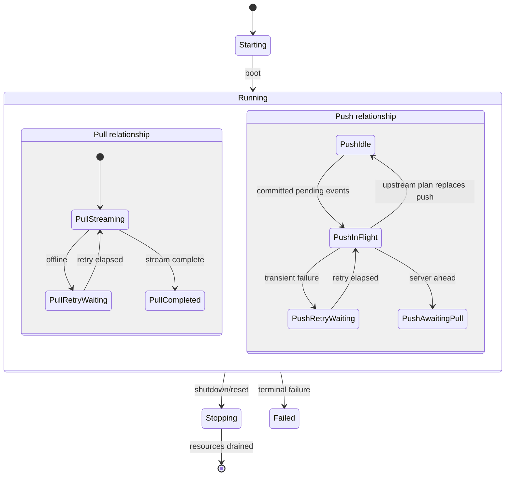
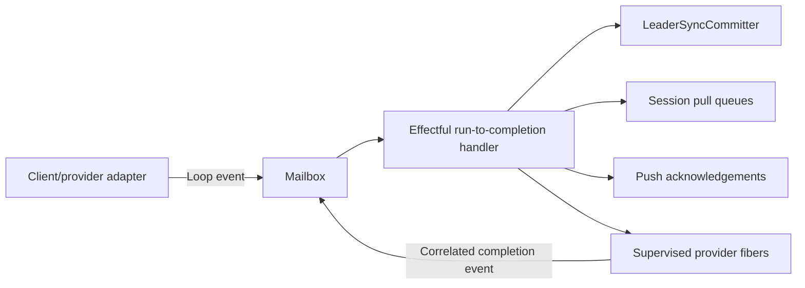
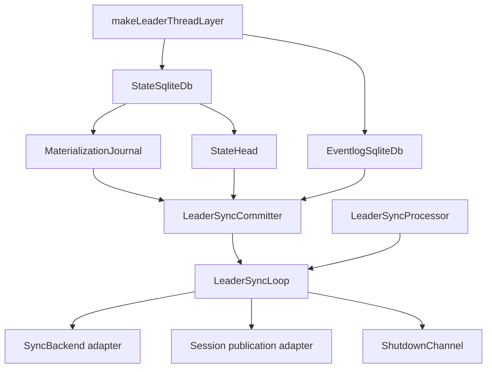

# Leader Sync Serialized Loop

> **Status:** Draft local architectural proposal. This document records the implementation experiment and does not
> replace accepted product intent.

## Context

The leader synchronizes client-session events with an optional upstream provider. Durable state and eventlog changes
are owned by `LeaderSyncCommitter`, while provider streams, session publication, retry timing, and acknowledgements
remain orchestration concerns.

The original processor coordinated those concerns through a local transaction queue, two semaphores, a restartable push
fiber, a long-lived pull stream, and mutable admission reservations. A subsequent pure state-machine experiment made
ordering explicit, but represented each operation twice: once as machine commands/results and once as Effect executors.
The serialized loop keeps the explicit ownership and correlation rules without that command protocol.

## Behavior Inventory

- `boot` publishes the persisted sync state, rehydrates pending upstream propagation, then starts local, push, and pull
  background work.
- local pushes reserve their complete sequence-number range before waiting for durable processing. Concurrent or stale
  batches are rejected against that reservation fence.
- local batches are materialized before sync state changes, session publication, provider scheduling, or acknowledgement.
- upstream pagination has priority over queued local work from the first non-empty page until `NoMore`, failure, or
  interruption.
- an upstream advance may confirm pending events, append new events, or rebase divergent pending history. The durable
  commit completes before the new state is published.
- an upstream commit replaces the provider push plan with the newly committed pending suffix.
- provider pushes wait for connectivity. Offline and unknown failures retry with exponential backoff capped at 30
  seconds. `ServerAheadError` waits for pull reconciliation.
- backend identity mismatch follows the configured reset, shutdown, or ignore policy.
- session pull queues retain committed payloads by head so later subscribers can catch up from a cursor.

## Invariants

1. One mailbox loop is the sole owner of orchestration state.
2. At most one local or upstream durable operation is active.
3. A non-empty upstream pagination sequence prevents new local durable work between pages.
4. Every admitted local event remains reserved until it is committed or explicitly rejected.
5. Observable sync state, session publication, provider propagation, and local acknowledgement occur only after the
   matching durable commit succeeds.
6. Concurrent provider and timer outcomes are accepted at most once and only when their operation identities match.
7. The observable local head equals the last durably committed local head. The upstream head never moves backwards.
8. Provider retries and cancellations are explicit loop states rather than hidden recursive effects.
9. `LeaderSyncCommitter` is the only normal-path owner of state/eventlog transitions.
10. State and eventlog databases use independent SQLite connections. The loop does not claim crash-atomic commits
    across both databases. A crash or eventlog `COMMIT` failure after the state commit may leave state ahead of
    eventlog truth and requires external recovery.
11. Durable work is awaited by the mailbox handler. Reset or shutdown arriving during a commit remains queued until the
    committed result has been published or failed; this is the loop's draining behavior.
12. A handler defect terminates the loop before another mailbox event is accepted, so publication or propagation
    failures cannot be followed by acknowledgement from the same transition.
13. Runtime termination atomically closes local-push admission before draining acknowledgement and pull-page
    registries. A push racing shutdown is interrupted instead of being left unresolved.

## Proposed Solution

The implementation uses a compact lifecycle with nested provider relationships. Durable work is not a separate state:
the mailbox itself is the single serialized durable-work owner.

Each mailbox turn handles one admitted event. Local and upstream durable turns perform merge, commit, receipt validation,
publication, propagation scheduling, and acknowledgement in one function. Provider calls and retry timers run in
supervised fibers because they are genuinely concurrent; their correlated outcomes return to the mailbox. A lightweight
`ContinueWork` event provides fairness between durable batches without exposing an internal command vocabulary.

## Effect Ownership

## Alternatives Considered

- **Keep semaphore/fiber orchestration and add state labels.** This leaves multiple state owners and cannot reject stale
  asynchronous completions consistently.
- **Use a pure event/command state machine.** The experiment made all transitions testable but created a shallow seam:
  one local commit required separate plan commands, plan-result events, commit commands, and completion events even
  though only one executor existed. Awaiting durable work in the serialized loop preserves ordering with better locality.
- **Adopt a general state-machine framework.** The compact loop makes lifecycle and provider states visible without
  framework-specific interpretation.
- **Move provider/session orchestration into `LeaderSyncCommitter`.** This would mix durable truth with retry and
  publication policy and make future hierarchy changes harder.

## Open Questions

- Whether a future storage format should use one attached SQLite transaction or a recovery protocol for cross-database
  crash consistency.
- Whether deterministic materialization failures under `onSyncError: "ignore"` should become a public typed push error
  rather than stopping synchronization without shutting down the host.
