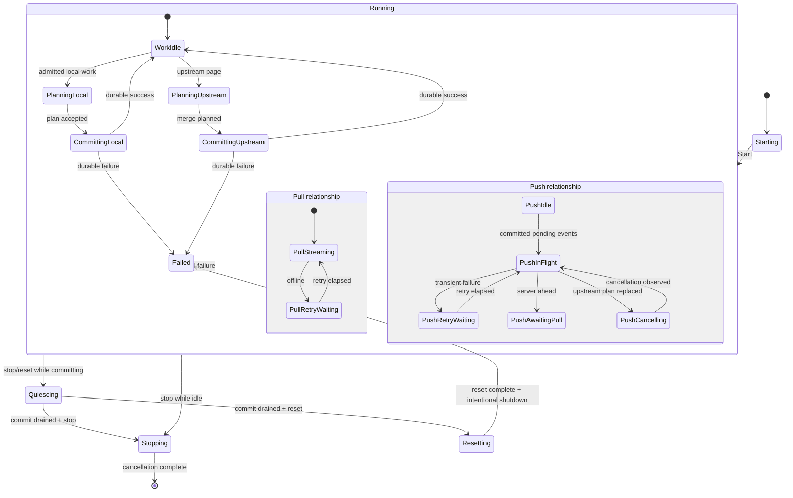
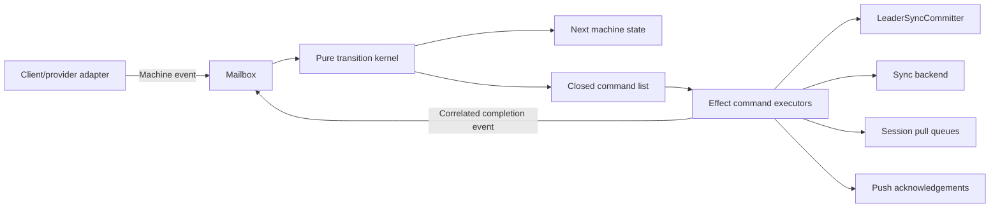
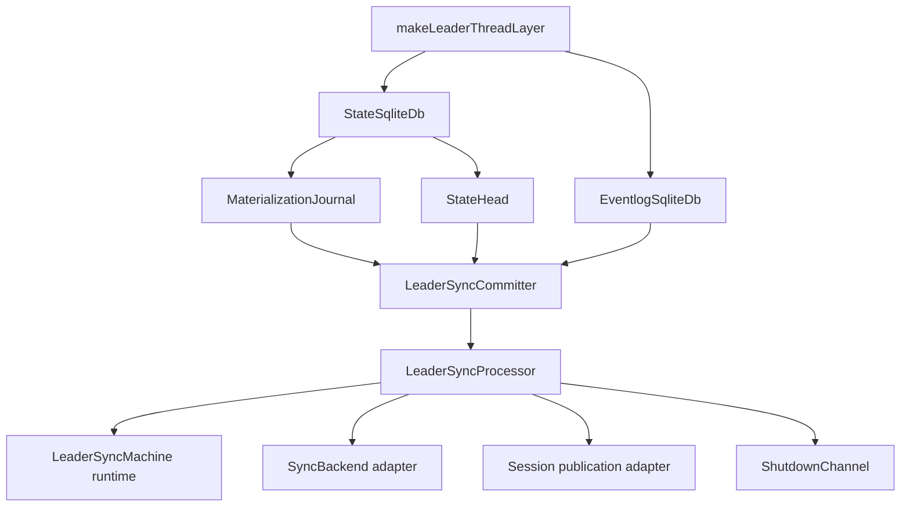

# Leader Sync Hierarchical State Machine

> **Status:** Draft local architectural proposal. This document records the implementation experiment and does not
> replace accepted product intent.

## Context

The leader synchronizes client-session events with an optional upstream provider. Durable state and eventlog changes
are owned by `LeaderSyncCommitter`, while provider streams, session publication, retry timing, and acknowledgements
remain orchestration concerns.

The pre-machine processor coordinated those concerns through a local transaction queue, two semaphores, a restartable
push fiber, a long-lived pull stream, and mutable admission reservations. The behavior was covered by integration tests,
but no single model described which operation owned synchronization state or how late asynchronous completions behaved.

## Behavior Inventory

- `boot` publishes the persisted sync state, rehydrates pending upstream propagation, then starts local, push, and pull
  background work.
- local pushes reserve their complete sequence-number range before waiting for durable processing. Concurrent or stale
  batches are rejected against that reservation fence.
- local batches are materialized before sync state changes, session publication, provider scheduling, or acknowledgement.
- upstream pagination has priority over queued local work from the first non-empty page until `NoMore`, failure, or
  interruption.
- an upstream advance may confirm pending events, append new events, or rebase divergent pending history. The durable
  commit completes before the new state is published.
- an upstream commit replaces the provider push plan with the newly committed pending suffix.
- provider pushes wait for connectivity. Offline and unknown failures retry with exponential backoff capped at 30
  seconds. `ServerAheadError` waits for pull reconciliation.
- backend identity mismatch follows the configured reset, shutdown, or ignore policy.
- session pull queues retain committed payloads by head so later subscribers can catch up from a cursor.

## Invariants

1. One mailbox loop is the sole owner of machine state.
2. At most one local or upstream durable operation is active.
3. A non-empty upstream pagination sequence prevents new local durable work between pages.
4. Every admitted local event remains reserved until it is committed or explicitly rejected.
5. Observable sync state, session publication, provider propagation, and local acknowledgement occur only after the
   matching durable commit succeeds.
6. Asynchronous outcomes are accepted at most once and only when their operation and generation identities match.
7. The observable local head equals the last durably committed local head. The upstream head never moves backwards.
8. Provider retries and cancellations are explicit machine states rather than hidden recursive effects.
9. `LeaderSyncCommitter` is the only normal-path owner of state/eventlog transitions.
10. State and eventlog databases use independent SQLite connections. The machine does not claim crash-atomic commits
    across both databases. A crash or eventlog `COMMIT` failure after the state commit may leave state ahead of
    eventlog truth and requires external recovery.
11. Reset and shutdown enter a quiescing phase when durable work is active. The matching commit outcome is published
    or failed before database reset or runtime termination begins.

## Proposed Solution

The implementation uses a small hierarchy:

The transition kernel is pure: `(state, event) -> { state, commands }`. Effects run behind command executors and return
their outcomes to the same mailbox with correlation identities. Immediate planning, publication, and acknowledgement
commands run serially. Provider calls, durable commits, retry timers, and test-only work gates run in supervised fibers.
The mailbox converts command defects into machine events and terminates after the explicit `StopRuntime` command.

## Effect Ownership

## Alternatives Considered

- **Keep semaphore/fiber orchestration and add state labels.** This leaves multiple state owners and cannot reject stale
  asynchronous completions consistently.
- **Adopt a general state-machine framework.** The domain needs Effect resource ownership and typed LiveStore events,
  while maintainers need to follow transitions without framework-specific interpretation. A compact explicit kernel is
  easier to audit.
- **Move provider/session orchestration into `LeaderSyncCommitter`.** This would mix durable truth with retry and
  publication policy and make future hierarchy changes harder.

## Open Questions

- Whether a future storage format should use one attached SQLite transaction or a recovery protocol for cross-database
  crash consistency.
- Whether deterministic materialization failures under `onSyncError: "ignore"` should become a public typed push error
  rather than stopping synchronization without shutting down the host.
