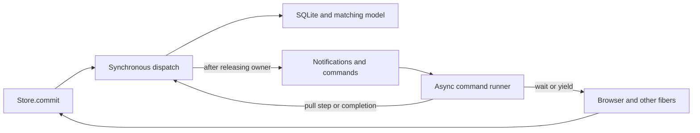

# Session sync: single owner with yielding reconciliation

Status: isolated experiment, not accepted intent. Based on the fixed split-owner checkpoint `4ead601cd`, not the
whole-batch synchronous prototype. The original `refactor/serialized-sync-processors` checkout is unchanged.

## The question

Can one synchronous owner improve human navigation without losing immediate Store commits, safe reconciliation,
or opportunities for browser input? Single ownership and whole-batch execution are independent choices.

| Variant | State writers | Work before yielding |
| --- | --- | --- |
| Fixed baseline (A) | Local commit path and mailbox pull handler | Complete upstream prefix plus live pending edits |
| Earlier alternative (B) | Synchronous dispatcher | Entire pulled batch |
| This experiment (C) | Synchronous dispatcher | Complete upstream prefix plus live pending edits |

The smallest useful third implementation retains the existing reconciliation loop as one asynchronous command.
It calls the synchronous owner once per step; it does not turn every cursor advance into a scheduled event. This
avoids introducing a continuation framework just to centralize writes. The loop's offset and cancellation flag are
traversal bookkeeping, not a second copy of the session model.

## Read it in this order

All orchestration is still in [ClientSessionSyncProcessor.ts](../../packages/@livestore/common/src/sync/ClientSessionSyncProcessor.ts).

1. `transition`: the only writer of the model, including SQLite commits, propagation reservations and lifecycle.
2. `dispatch`: prevents materializer reentrancy and stages notifications until the transition owner is released.
3. `boot` / `reconcile` / `runCommand`: owns network fibers, waiting, cancellation and yielding. Calls dispatch;
   does not write domain state. Checks a queued push's identity before starting it.
4. [Store.commit](../../packages/@livestore/livestore/src/store/store.ts): one processor call, then its existing
   tracing, refresh, skipRefresh and error/shutdown behavior.



```text
Store.commit
  processor.commit
    dispatch(Commit)
      encode + merge
      savepoint: materialize batch + journal + head
      install model and reserve propagation
      release owner, publish and enqueue commands
  Store refreshes subscribers (they may commit synchronously)

leader pull arrives
  dispatch(PullReceived): validate payload and accept a reconciliation identity
  command runner: Reconcile
    dispatch(PullStep): merge live pending, apply one complete SQLite/model step
    if cancellation is needed: wait outside dispatch, then retry from live state
    refresh subscribers after dispatch returns
    yield; local commits may run
    repeat until the accepted payload is complete
    dispatch(PullFinished): release reconciliation and schedule propagation

leader push completes
  dispatch(PushSucceeded / PushRejected / PushFailed)
    ignore obsolete identity, otherwise update current propagation state
```

This is a synchronous, effectful owner, not a pure reducer or strict input-FIFO actor. The command queue schedules
work; it does not define event-log order. Sequence numbers and SyncState.merge still govern reconciliation.

## What gets simpler, and what does not

- Removed the session interface's encode/materialize/push sequence in favor of `commit(events)`. The processor owns
  the entire local savepoint and matching model installation; Store still owns its local subscriber refresh.
- Removed delayed `LocalPushAdmitted` and its obsolete-encoding filtering. New local events enter the current
  propagation state within the same transition, and no replacement push starts during reconciliation.
- Every model assignment is in transition. Waiting and storage state changes are no longer interleaved in a handler.
- Added an explicit command vocabulary and reconciliation identity, plus notification staging. This is a real cost
  in concepts even though it introduces no additional production module.
- The large event switch centralizes navigation but may be less pleasant to read than the baseline's focused async
  functions. Fewer writers do not, by themselves, prove a simpler mental model.

Effect Queue and Deferred notifications can resume another fiber inline. Merely suppressing automatic scheduler
yields is therefore insufficient to prevent reentrant observers. Dispatch collects these notifications, releases
the owner, then sends them. Subscriber refresh is also outside the owner. Reentrant commits from unfinished
materializers are rejected; subscriber commits after a completed step are supported.

## Guarantees and differences

| Concern | Contract in this experiment |
| --- | --- |
| Immediate local read | Store.commit finishes the local SQLite/model transition before returning. |
| Observable pull state | Every step exposes a complete upstream prefix plus current pending edits. |
| Local batch failure | One outer savepoint rolls back the entire batch; no model installation or propagation. |
| Fatal result during reconciliation | Failure is handled immediately; identity/lifecycle checks prevent another step or finalization. |
| Graceful shutdown | Close admission immediately, finish the accepted pull, then drain the rebuilt pending suffix. |
| Late command/result | Validate operation identity before execution and again on completion. |
| Whole-payload atomicity | Not guaranteed; earlier successful prefixes remain after a later step fails. |
| Frame budget | Not guaranteed; pending replay, large explicit rebases and expensive callbacks remain unbounded. |
| Async storage/materializers | Unsupported, as with synchronous Store.commit. PreventSchedulerYield does not make genuine async work synchronous. |
| Crash atomicity/durability | No new guarantee; session optimism and leader cross-database crash limitations are unchanged. |

Unlike the baseline, a push completion can be handled between pull steps, not only after the complete mailbox turn.
This consequential ordering change requires recovery to consult current rejection state. A regression test confirms
that a rejection arriving between acknowledgment prefixes cannot leave an empty pending queue permanently fenced.

## Tests and review

The ten baseline real-Store safety regressions remain. Three new real-Store cases cover local multi-event rollback,
fatal push failure after a coherent prefix, and propagation of final encodings after subscriber commits at two prefixes.
The existing processor harness now calls commit and uses real SQLite for savepoints; one additional test injects a
rejection between acknowledgment-only prefixes and checks subsequent propagation and graceful drain.

Read-only exploration and two review passes checked Store integration, ownership, callbacks, command identities,
failure, cancellation and shutdown. Review found the rejection-snapshot bug described above; the fix removed the
snapshot. Disabling recovery makes the new regression fail its drain assertion. The second review found no additional
high/medium correctness issue, while explicitly noting the cost of staged notifications to readability.

Tracing keeps the local encode/materialize spans and event-count metadata. The old push span becomes a commit span
covering the complete local transition. Eighteen generated query-trace snapshots reflect this and the new outer local
savepoint; no functional query assertions were removed.

Browser fixture and results: [run instructions](../../tests/perf/session-sync/README.md),
[interpretation](../../tests/perf/session-sync/DECISION.md), and [complete table](../../tests/perf/session-sync/RESULTS.md).
The final 130-sample run passed every checked invariant for both versions, with closely comparable timings. It supports
preserving responsiveness with single ownership; it does not decide whether that ownership is easier to understand.

The final processor is 640 lines versus the baseline's 600; Store's commit plumbing loses 15 lines. There is no new
production module. This is a net 25-line production increase, not a deletion-based simplification. Most of the branch
diff is tests, trace snapshots, the browser fixture and documentation.

## Experiment checklist

- [x] Start from the fixed checkpoint in an isolated worktree.
- [x] One synchronous owner; retain small complete reconciliation steps and existing Store behavior.
- [x] Run baseline regressions and add tests for changed completion ordering.
- [x] Review, fix justified findings and review the revised implementation.
- [x] Compare complete browser runs for input delay, catch-up time and correctness.
- [ ] Decide with a human code read whether the ownership change earns its additional concepts.

No new accepted context contract or release is proposed. Related existing issue: [#1465](https://github.com/livestorejs/livestore/issues/1465).
