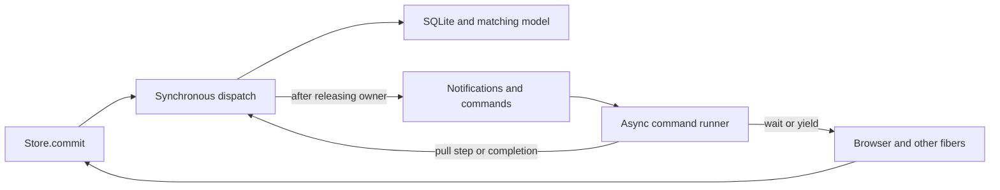

# Session sync: single owner with yielding reconciliation

Status: preferred session-sync direction for the fork as of September 17, 2026, not accepted upstream intent.
The user chose refactored C at `66ca5d3e0`; [the main RFC](./0004-serialized-sync-processors.md) now describes it directly.
This companion preserves the experiment's design rationale, alternatives and validation history. C builds on the fixed
split-owner checkpoint `4ead601cd`, not the whole-batch synchronous prototype. A remains preserved on
`codex/split-owner-a`, independently of whether its worktree is retained. The canonical fork refactor branch,
`refactor/serialized-sync-processors`, now follows C.

## The question

Can one synchronous owner improve human navigation without losing immediate Store commits, safe reconciliation,
or opportunities for browser input? Single ownership and whole-batch execution are independent choices.

| Variant                   | State writers                              | Work before yielding                             |
| ------------------------- | ------------------------------------------ | ------------------------------------------------ |
| Fixed baseline (A)        | Local commit path and mailbox pull handler | Complete upstream prefix plus live pending edits |
| Earlier alternative (B)   | Synchronous dispatcher                     | Entire pulled batch                              |
| Preferred fork design (C) | Synchronous dispatcher                     | Complete upstream prefix plus live pending edits |

The smallest useful third implementation retains the existing reconciliation loop as one asynchronous command.
It calls the synchronous owner once per step; it does not turn every cursor advance into a scheduled event. This
avoids introducing a continuation framework just to centralize writes. The loop's offset and cancellation flag are
traversal bookkeeping, not a second copy of the session model.

## Read it in this order

All orchestration is still in [ClientSessionSyncProcessor.ts](../../packages/@livestore/common/src/sync/ClientSessionSyncProcessor.ts).

1. `transition`: a short routing switch showing local commit, pull, push completion and shutdown workflows.
2. `dispatch`: the synchronous ownership guard. Prevents materializer reentrancy and delivers staged notifications
   only after a successful transition releases the owner.
3. `commitLocalEvents` / `acceptPull` / `applyPullStep` / `finishPull`: named owner workflows. `applyPullStep` keeps
   the sequence visible: check identity, merge live state, request cancellation if needed, apply SQLite, install the
   matching model, then stage publication. `applyPullToSqlite` contains the complete savepoint and journal details.
4. `completePush` / `reserveNextPush` / `requestShutdown` / `startDrain` / `failSession`: propagation and lifecycle
   workflows under the same owner. Reserving a push changes the model before its command becomes visible.
5. `reconcile` / `startLeaderPush` / `runCommand` / `runCommands` / `pull`: asynchronous execution. These functions
   call dispatch and never write domain state. The reconciliation loop keeps cancellation, retry, refresh and yield
   together; `startLeaderPush` checks a queued push's identity before starting it.
6. `boot`: acquires the fiber handles, installs the unload listener, and starts the owner and runners. Its scope still
   owns all those resources. Defining the lazy execution helpers outside boot does not start them early.
7. [Store.commit](../../packages/@livestore/livestore/src/store/store.ts): one processor call, then its existing
   tracing, refresh, skipRefresh and error/shutdown behavior.



```text
Store.commit
  processor.commit
    dispatch(Commit)
      encode + merge
      savepoint: materialize batch + journal + head
      install model and reserve propagation
      release owner, publish and enqueue commands
  Store refreshes subscribers (they may commit synchronously)

leader pull arrives
  dispatch(PullReceived): validate payload and accept a reconciliation identity
  command runner: Reconcile
    dispatch(PullStep): merge live pending, apply one complete SQLite/model step
    if cancellation is needed: wait outside dispatch, then retry from live state
    refresh subscribers after dispatch returns
    yield; local commits may run
    repeat until the accepted payload is complete
    dispatch(PullFinished): release reconciliation and schedule propagation

leader push completes
  dispatch(PushSucceeded / PushRejected / PushFailed)
    ignore obsolete identity, otherwise update current propagation state
```

This is a synchronous, effectful owner, not a pure reducer or strict input-FIFO actor. The command queue schedules
work; it does not define event-log order. Sequence numbers and SyncState.merge still govern reconciliation.

An input handler can wait for a synchronous pull step to finish before it starts. Once it calls Store.commit, the
local change completes before that call returns. Yielding between steps creates input opportunities; it does not
guarantee a frame budget or make network pull synchronous.

## What gets simpler, and what does not

- Removed the session interface's encode/materialize/push sequence in favor of `commit(events)`. The processor owns
  the entire local savepoint and matching model installation; Store still owns its local subscriber refresh.
- Removed delayed `LocalPushAdmitted` and its obsolete-encoding filtering. New local events enter the current
  propagation state within the same transition, and no replacement push starts during reconciliation.
- Every model assignment is in transition or its private owner workflows. Waiting and storage state changes are no
  longer interleaved in a handler.
- Added an explicit command vocabulary and reconciliation identity, plus notification staging. This is a real cost
  in concepts even though it introduces no additional production module.
- The routing switch centralizes navigation while private functions group the owner workflows. Persistence details
  and asynchronous execution have separate sections in the same file. Fewer writers do not, by themselves, prove a
  simpler mental model; the named workflows add navigation points and do not remove the notification-stage contract.

Effect Queue and Deferred notifications can resume another fiber inline. Merely suppressing automatic scheduler
yields is therefore insufficient to prevent reentrant observers. Dispatch collects these notifications, releases
the owner, then sends them. Subscriber refresh is also outside the owner. Reentrant commits from unfinished
materializers are rejected; subscriber commits after a completed step are supported.

## Guarantees and differences

| Concern                            | Contract in the preferred fork implementation                                                                      |
| ---------------------------------- | ------------------------------------------------------------------------------------------------------------------ |
| Immediate local read               | Store.commit finishes the local SQLite/model transition before returning.                                          |
| Observable pull state              | Every step exposes a complete upstream prefix plus current pending edits.                                          |
| Local batch failure                | One outer savepoint rolls back the entire batch; no model installation or propagation.                             |
| Fatal result during reconciliation | Failure is handled immediately; identity/lifecycle checks prevent another step or finalization.                    |
| Graceful shutdown                  | Close admission immediately, finish the accepted pull, then drain the rebuilt pending suffix.                      |
| Late command/result                | Validate operation identity before execution and again on completion.                                              |
| Whole-payload atomicity            | Not guaranteed; earlier successful prefixes remain after a later step fails.                                       |
| Frame budget                       | Not guaranteed; pending replay, large explicit rebases and expensive callbacks remain unbounded.                   |
| Async storage/materializers        | Unsupported, as with synchronous Store.commit. PreventSchedulerYield does not make genuine async work synchronous. |
| Crash atomicity/durability         | No new guarantee; session optimism and leader cross-database crash limitations are unchanged.                      |

Unlike the baseline, a push completion can be handled between pull steps, not only after the complete mailbox turn.
This consequential ordering change requires recovery to consult current rejection state. A regression test confirms
that a rejection arriving between acknowledgment prefixes cannot leave an empty pending queue permanently fenced.

## Tests and review

The ten baseline real-Store safety regressions remain. Three new real-Store cases cover local multi-event rollback,
fatal push failure after a coherent prefix, and propagation of final encodings after subscriber commits at two prefixes.
The existing processor harness now calls commit and uses real SQLite for savepoints; one additional test injects a
rejection between acknowledgment-only prefixes and checks subsequent propagation and graceful drain.

Read-only exploration and two review passes checked Store integration, ownership, callbacks, command identities,
failure, cancellation and shutdown. Review found the rejection-snapshot bug described above; the fix removed the
snapshot. Disabling recovery makes the new regression fail its drain assertion. The second review found no additional
high/medium correctness issue, while explicitly noting the cost of staged notifications to readability.

Tracing keeps the local encode/materialize spans and event-count metadata. The old push span becomes a commit span
covering the complete local transition. Eighteen generated query-trace snapshots reflect this and the new outer local
savepoint; no functional query assertions were removed.

Browser fixture and results: [run instructions](../../tests/perf/session-sync/README.md),
[interpretation](../../tests/perf/session-sync/DECISION.md), and [complete table](../../tests/perf/session-sync/RESULTS.md).
The final 130-sample run passed every checked invariant for both versions, with closely comparable timings. It supports
preserving responsiveness with single ownership; it does not decide whether that ownership is easier to understand.
The measured comparison is fixed A versus C, not main. Choosing C is a human architecture decision, not a measured
performance win over main.

At the original measured checkpoint, the processor was 640 lines versus the baseline's 600; Store's commit plumbing
lost 15 lines. The subsequent structural refactor adds private workflow functions and explicit helper types, keeping
all orchestration in this file. Its benefit is readable operation sequences, not fewer lines. No new production
module or event protocol is introduced.

The September 17, 2026 structural refactor passed the root unit suite (129 passed, 1 skipped), the focused session
regressions (45 passed), the Common/LiveStore package suites (352 passed, 1 skipped), both TypeScript checks and full
lint. A fresh browser comparison also passed all 130 samples with zero correctness or trial failures. The original
measurement artifacts remain unchanged; the rerun validates the refactor without replacing the recorded comparison.

## Explicit-state follow-up (September 24, 2026)

A review found that some session state still lived outside `Model`: the runner's `pushCancelled` flag, the
`shutdownExit`/`terminalCause` fields beside a string lifecycle, and a `failed → stopping` path that the lifecycle
diagram did not show. The follow-up changes, all in `ClientSessionSyncProcessor.ts`:

- `lifecycle` is a tagged union: `starting | running | shutdown-requested | stopping | failed | stopped`, with the
  reconciliation identity inside the states where it can exist. A failed session finishes shutdown directly.
- `push: cancelling` records a push being stopped for a rebase; the runner reports `PushCancelled` afterwards. Late
  success or rejection of that operation is ignored; a fatal failure still fails the session.
- `owned(body)` replaces the `dispatching` flag and threaded `deferNotification`, staging notifications through
  `stage(...)`. A microtask check detects a body that suspended; it then fails the session with a named defect instead
  of surfacing later as a misleading reentrancy error or leaving shutdown waiting on dropped commands. A first version
  ran the body on a separate `Effect.runSyncExitWith` fiber; interleaved perf runs showed about +4% on the
  10,000-item commit, while running the body inline (the old way, with every other change kept) matched the baseline.
  `commit` and pull steps call it directly, so `Event` only lists inputs without a result.
- A failed `PullReceived` fails the pull fiber instead of leaving it waiting on a dropped `completed` signal.
- Development builds check after every owner body that the push queue is the unpushed suffix of pending events.

Verified from Effect 4.0.0-beta.99 source: resuming a fiber calls `fiber.evaluate` inline, and the resumed fiber reads
its own `PreventSchedulerYield`. The main RFC now documents the resulting refresh-ordering consequence for Store.

## Experiment and fork-decision checklist

- [x] Extract pull persistence into one savepoint helper, keeping SQLite-before-model ordering visible.
- [x] Give owner workflows names and retain one guarded dispatch entrypoint.
- [x] Separate asynchronous execution from boot resource acquisition and startup.
- [x] Rerun regression tests, TypeScript, lint and the browser comparison after the structural refactor.
- [x] Start from the fixed checkpoint in an isolated worktree.
- [x] One synchronous owner; retain small complete reconciliation steps and existing Store behavior.
- [x] Run baseline regressions and add tests for changed completion ordering.
- [x] Review, fix justified findings and review the revised implementation.
- [x] Compare complete browser runs for input delay, catch-up time and correctness.
- [x] Choose refactored C as the current fork direction after the human readability review.
- [x] Explain C directly in the main RFC and preserve A, B and Effect Machine as alternatives on branches.

This fork choice does not establish upstream acceptance, a new accepted context contract or a release.
Staged notifications and owner/runner navigation remain conscious costs.
Related existing issue: [#1465](https://github.com/livestorejs/livestore/issues/1465).
